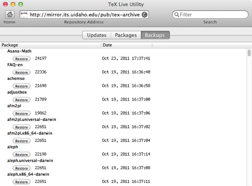

# This page only provides a limited feature overview.  Please use the Help menu to access TeX Live Utility's documentation.

# Introduction

The primary feature of TeX Live Utility is updating a MacTeX installation.  When first launching the program, this is the screen that will be visible:

Installed and Remote columns show the TeX Live version number for the package.  Size shows the installed size in bytes.

# Updating

To update all packages, use the **Actions->Update All Packages** menu item or associated keyboard shortcut.  Individual packages can also be updated by selecting them in the list and using the **Actions->Update Selected Packages** menu item.  A context menu with these items is also available by right-clicking or control-clicking on the list.

The **Update All Packages** action will also remove and install packages to match the TeX Live database on the remote server.

# Installing

Packages can be installed using the “Packages” tab:

Note that some packages have multiple architectures, and you generally only want to install the darwin version for Mac OS X.  This is not a generic package installer.  Only TeX Live packages that exist on the server will be listed.

# Paper Size

Use the Configure menu to change paper size.  The current paper size is given by pdftex, but changing paper size will change it for _all_ TeX programs.  If you want to change paper size for a single program, e.g. dvips, use the tlmgr command-line tool.

# Backups

TeX Live Manager will automatically keep backups for you when it installs a new package, which can be very useful if an update suddenly keeps your documents from compiling!

Use the Configure menu to change automatic backup settings.  If you want to keep all backups, enter ∞ (opt-5) for the number to keep.  If the “Prune backups” box is checked, old backups will be removed, excluding the number specified for keeping.

You can restore backups using the “Backups” tab by clicking the “Restore” button next to the package version that you want to install.

# Show Info

You can display detailed information for a specific package in an inspector panel:

This panel also shows links and thumbnails for documentation, found using texdoc.

# Settings

See the PreferencesPage for details.